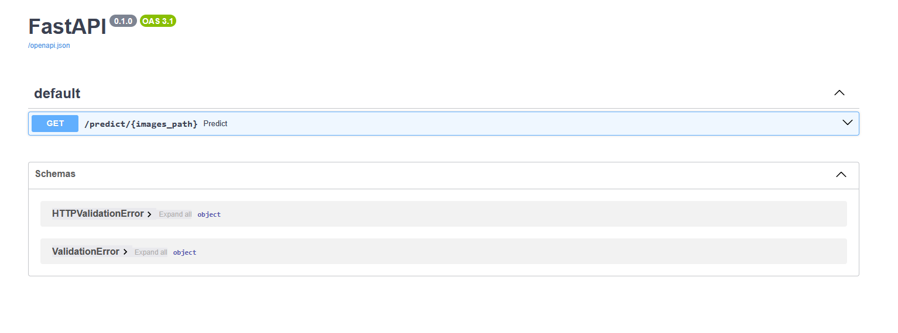
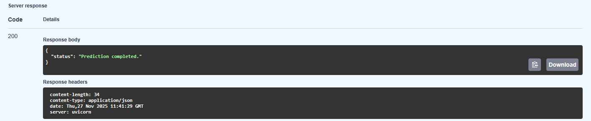

# Description

This project can be used for different tasks, where you need to classify human's emotions by the photo of their faces.

Available classes are: angry, fear, happy, sad and surprise.

# Installation and usage

1. One your terminal and paste there command: 

```git clone https://github.com/Supcanc/human_face_emotions_classification```.


2. Load images that you want to predict in images_for_test/ directory.


3. Enable your Docker. If you use the model on CPU, you should change this line in Dockerfile:

```RUN pip install torch==2.9.1+cu130 torchvision==0.24.1+cu130 --index-url https://download.pytorch.org/whl/cu130```

to:

```RUN pip install torch==2.9.1 torchvision==0.24.1```

If you use GPU, but it's not NVIDIA you should check how to install it on Pytorch website and change this line in Dockerfile.

4. Type in the terminal(in the project diretctory) this command: 

```docker-compose build```.


5. Then type another command in this directory:

```docker-compose up```.


6. You'll see a link in a terminal, click on it and then add /docs to the end of this link and you'll be taken to this page:

7. Click on button 'GET'.


8. Click on button 'Try it out'.


9. Type images_for_test in description input window.


10. Click button 'Execute'.


11. Check if the response is same:

12. There will be file predictions.txt in your /predictions directory with all your predictions.

# Dataset Information

This project uses [Human Face Emotions dataset](https://www.kaggle.com/datasets/samithsachidanandan/human-face-emotions/data), created by Samith Chimminiyan. The dataset was obtained via Kaggle.